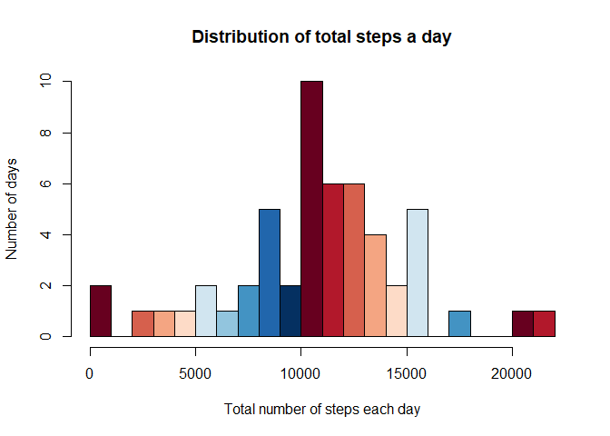
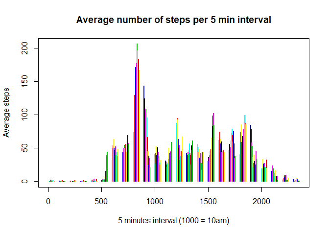
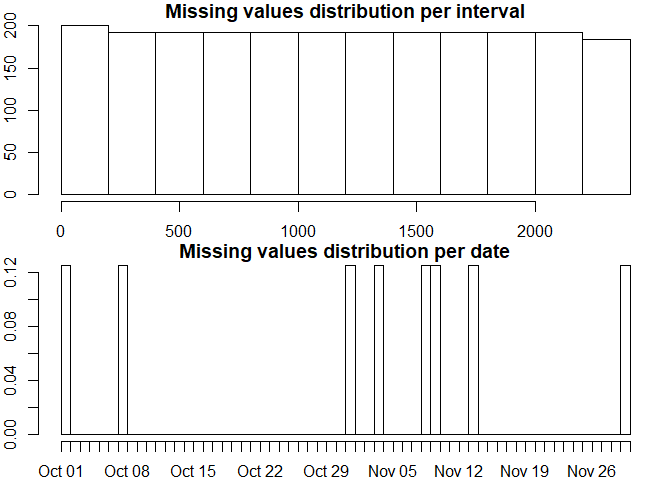
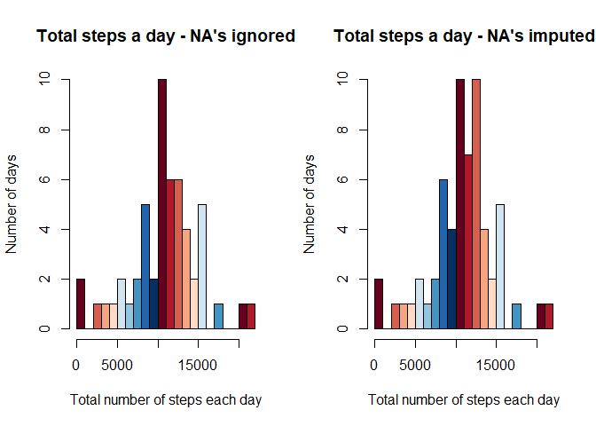
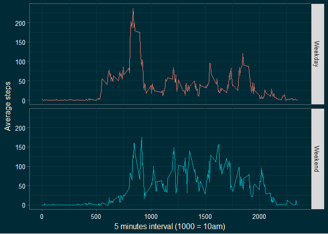

## Loading and preprocessing the data

The data for this assignment was downloaded from the [course web site][1] in May 2018.

  [1]: https://d396qusza40orc.cloudfront.net/repdata%2Fdata%2Factivity.zip/  "course web site"


```r
# Reading the downloaded data file
unzip("activity.zip")
amd <- read.csv("activity.csv")
```

### Quick overview of the data set


```r
summary(amd)
```

```
##      steps                date          interval     
##  Min.   :  0.00   2012-10-01:  288   Min.   :   0.0  
##  1st Qu.:  0.00   2012-10-02:  288   1st Qu.: 588.8  
##  Median :  0.00   2012-10-03:  288   Median :1177.5  
##  Mean   : 37.38   2012-10-04:  288   Mean   :1177.5  
##  3rd Qu.: 12.00   2012-10-05:  288   3rd Qu.:1766.2  
##  Max.   :806.00   2012-10-06:  288   Max.   :2355.0  
##  NA's   :2304     (Other)   :15840
```


```r
str(amd)
```

```
## 'data.frame':	17568 obs. of  3 variables:
##  $ steps   : int  NA NA NA NA NA NA NA NA NA NA ...
##  $ date    : Factor w/ 61 levels "2012-10-01","2012-10-02",..: 1 1 1 1 1 1 1 1 1 1 ...
##  $ interval: int  0 5 10 15 20 25 30 35 40 45 ...
```

Converting the date variable from a factor to a date class


```r
amd$date <- as.Date(amd$date)
```


### Loading the libraries used in this analysis


```r
library(dplyr)
```

```
## 
## Attaching package: 'dplyr'
```

```
## The following objects are masked from 'package:stats':
## 
##     filter, lag
```

```
## The following objects are masked from 'package:base':
## 
##     intersect, setdiff, setequal, union
```

```r
library(ggplot2)
library(ggthemes)
library(RColorBrewer)
```


## What is mean total number of steps taken per day?

### 1. Calculate the total number of steps taken per day.

Note: Using the sum function with *na.rm = TRUE* would lead to NA's being read as a zero and would show that way in the histogram. To ignore the NA's we can filter out the missing data. 


```r
stepSum <- amd %>% filter(!is.na(steps)) %>% group_by(date) %>% summarise(steps = sum(steps))
```

### 2. Make a histogram of the total number of steps taken each day.


```r
hist(stepSum$steps, breaks = 20,
     col = brewer.pal(n = 10, name = "RdBu"),
     main = "Distribution of total steps a day",
     xlab = "Total number of steps each day", 
     ylab = "Number of days")
```

<!-- -->

### 3. Calculate and report the mean and median of the total number of steps taken per day.


```r
mean(stepSum$steps, na.rm = TRUE)
```

```
## [1] 10766.19
```

```r
median(stepSum$steps, na.rm = TRUE)
```

```
## [1] 10765
```

The person took 10,766.19 steps a day on average with a median of 10,765 steps.


## What is the average daily activity pattern?

###1. Make a time series plot of the 5-minute interval (x-axis) and the average number of steps taken, averaged across all days (y-axis).


```r
# Calculating the average steps per 5 min interval
interMean <- amd %>% filter(!is.na(steps)) %>% group_by(interval) %>% summarise(steps = mean(steps))
# Plotting
with(interMean, plot(interval, steps, type = "h", lwd = 2, col = interval, 
                        main = "Average number of steps per 5 min interval", 
                        xlab = "5 minutes interval (1000 = 10am)", 
                        ylab = "Average steps"))
```

<!-- -->

### 2. Which 5-minute interval, on average across all the days in the dataset, contains the maximum number of steps?


```r
# Finding the maximum number of steps on average per interval
maxStep <- max(interMean$steps)
maxStep
```

```
## [1] 206.1698
```

```r
# Finding the interval containing the maximum steps
with(interMean, interval[which.max(steps)])
```

```
## [1] 835
```

On average, the person took the most steps (206.17) during the 835 interval (8:35am).


## Imputing missing values

Note that there are a number of days/intervals where there are missing values (coded as \color{red}{\verb|NA|}NA). The presence of missing days may introduce bias into some calculations or summaries of the data.

### 1.Calculate and report the total number of missing values in the dataset (i.e. the total number of rows with \color{red}{\verb|NA|}NAs).


```r
# Checking number of missing values for the data set
sum(is.na(amd))
```

```
## [1] 2304
```

```r
# Checking the percentage of missing values in number of rows
sum(is.na(amd)/nrow(amd))
```

```
## [1] 0.1311475
```

We can see that 2304 (13.11%) rows have missing values in the dataset. We already know from the summary in the beginning that all missing data occurs in the *step* column, but can check again.


```r
sum(is.na(amd$steps))
```

```
## [1] 2304
```

### 2. Devise a strategy for filling in all of the missing values in the dataset.

In order to determine a strategy, let's subset the missing values and look at their distribution over the other two variables in the data set with histograms.


```r
# Subsetting missing values only
mv <- subset(amd, is.na(amd$steps))
# General plot settings
par(mfrow = c(2,1), mar = c(2, 2, 1, 1))
# Histograms
hist(mv$interval, main = "Missing values distribution per interval")
hist(mv$date, main = "Missing values distribution per date", breaks = 61)
```

<!-- -->

We can see from the histograms that the NA's are distributed equally over the intervals and that 8 days are missing data in the set, spread somewhat randomly. (8 out of 61 days is also 13.11%) We could take the mean for missing intervals across all days to replace them - or - **given that most people have a daily routine to some degree, we can fill the missing days with the mean of the intervals of that specific day in the dataset.**

### 3. Create a new dataset that is equal to the original dataset but with the missing data filled in.

In order to find out which weekdays need to be replaced, we add a *weekday* column to the dataset and split the set in two, with and without the missing days.   


```r
#Adding weekday variable
amd$weekday <- weekdays(amd$date)
# Splitting the dataset
amd_mv <- subset(amd, is.na(amd$steps))
amd_no_mv <- subset(amd, !is.na(amd$steps))
```

Now we have a look at the missing days and what weekdays they represent.


```r
mv_days <- data.frame(date = unique(amd_mv$date), weekday = weekdays(unique(amd_mv$date)))
mv_days
```

```
##         date   weekday
## 1 2012-10-01    Monday
## 2 2012-10-08    Monday
## 3 2012-11-01  Thursday
## 4 2012-11-04    Sunday
## 5 2012-11-09    Friday
## 6 2012-11-10  Saturday
## 7 2012-11-14 Wednesday
## 8 2012-11-30    Friday
```

Next we calculate the mean per interval (mein) of all weekdays with the R dplyr package, filter the mein for the weekday needing replacement, find the dates with missing steps in the original dataset, replace the NA's in them with the particular mein and bind all back together into a complete dataset.


```r
# mean per interval (mein) of all weekdays
mein <- amd_no_mv %>% group_by(interval, weekday) %>% summarise(steps = mean(steps))
# Replacing missing data for day 1 
mv1 <- filter(amd, date == mv_days[1,1])
mein1 <- filter(mein, weekday == mv_days[1,2])
mv1$steps <- mein1$steps
# day 2 
mv2 <- filter(amd, date == mv_days[2,1])
mein2 <- filter(mein, weekday == mv_days[2,2])
mv2$steps <- mein2$steps
# day 3 
mv3 <- filter(amd, date == mv_days[3,1])
mein3 <- filter(mein, weekday == mv_days[3,2])
mv3$steps <- mein3$steps
# day 4
mv4 <- filter(amd, date == mv_days[4,1])
mein4 <- filter(mein, weekday == mv_days[4,2])
mv4$steps <- mein4$steps
# day 5
mv5 <- filter(amd, date == mv_days[5,1])
mein5 <- filter(mein, weekday == mv_days[5,2])
mv5$steps <- mein5$steps
# day 6
mv6 <- filter(amd, date == mv_days[6,1])
mein6 <- filter(mein, weekday == mv_days[6,2])
mv6$steps <- mein6$steps
# day 7
mv7 <- filter(amd, date == mv_days[7,1])
mein7 <- filter(mein, weekday == mv_days[7,2])
mv7$steps <- mein7$steps
# day 8
mv8 <- filter(amd, date == mv_days[8,1])
mein8 <- filter(mein, weekday == mv_days[8,2])
mv8$steps <- mein8$steps
```

Finally, we rbind them togeher and sort the data by date.


```r
amd_full <- rbind(amd_no_mv, mv1,mv2,mv3,mv4,mv5,mv6,mv7,mv8)
amd_full <- arrange(amd_full, date)
```

Checking for missing values.


```r
sum(is.na(amd_full$steps))
```

```
## [1] 0
```

### 4. Make a histogram of the total number of steps taken each day and calculate and report the mean and median total number of steps taken per day. Do these values differ from the estimates from the first part of the assignment? What is the impact of imputing missing data on the estimates of the total daily number of steps?

In order to compare the total number of steps taken each day, with and without the missing values filled in, let's plot both histograms underneath each other, starting with the histogram from the first part of the assignment.


```r
# Calculating total number of steps taken per day with imputed values
stepSum2 <- amd_full %>% group_by(date) %>% summarise(steps = sum(steps))
# General plot settings
par(mfrow = c(1,2))
# histograms
hist(stepSum$steps, breaks = 20,
     col = brewer.pal(n = 10, name = "RdBu"),
     main = "Total steps a day - NA's ignored",
     xlab = "Total number of steps each day", 
     ylab = "Number of days")
hist(stepSum2$steps, breaks = 20,
     col = brewer.pal(n = 10, name = "RdBu"),
     main = "Total steps a day - NA's imputed",
     xlab = "Total number of steps each day", 
     ylab = "Number of days")
```

<!-- -->

Mean and median with NA's removed:


```r
mean_old <- mean(stepSum$steps, na.rm = TRUE)
mean_old
```

```
## [1] 10766.19
```

```r
median_old <- median(stepSum$steps, na.rm = TRUE)
median_old
```

```
## [1] 10765
```

Mean and median with NA's imputed:


```r
mean_new <- mean(stepSum2$steps, na.rm = TRUE)
mean_new
```

```
## [1] 10821.21
```

```r
median_new <- median(stepSum2$steps, na.rm = TRUE)
median_new
```

```
## [1] 11015
```

Difference:


```r
# Mean
mean_new - mean_old
```

```
## [1] 55.02092
```

```r
# Median
median_new - median_old
```

```
## [1] 250
```

Both estimates slightly increase with the imputed days. 


## Are there differences in activity patterns between weekdays and weekends?

### 1. Create a new factor variable in the dataset with two levels - "weekday" and "weekend" indicating whether a given date is a weekday or weekend day.


```r
# Creating variable daytype
amd_full <- amd_full %>% mutate(daytype = ifelse(weekday %in% c("Saturday", "Sunday"), "Weekend", "Weekday"))
# Converting to a factor variable
amd_full$daytype <- as.factor(amd_full$daytype)
```

### 2. Make a panel plot containing a time series plot of the 5-minute interval (x-axis) and the average number of steps taken, averaged across all weekday days or weekend days (y-axis).


```r
# Calculating the average steps per type of day
activity_pattern <- amd_full %>% group_by(interval, daytype) %>% summarise(steps_avg = mean(steps)) 
# Creating the panel plot
g <- ggplot(activity_pattern, aes(x = interval, y = steps_avg, color = daytype)) + 
    geom_line() +
    facet_grid(daytype~.) +
    theme_solarized(light = FALSE) +
    xlab("5 minutes interval (1000 = 10am)") +
    ylab("Average steps") +
    theme(axis.text = element_text(colour = "ghostwhite"),
          axis.title = element_text(colour = "floralwhite"),
          legend.position="none")
print(g)
```

<!-- -->
   
Comparing the plots we see that the person is more active early in the day during weekdays (probably getting ready for work), but more active in general on weekends.

